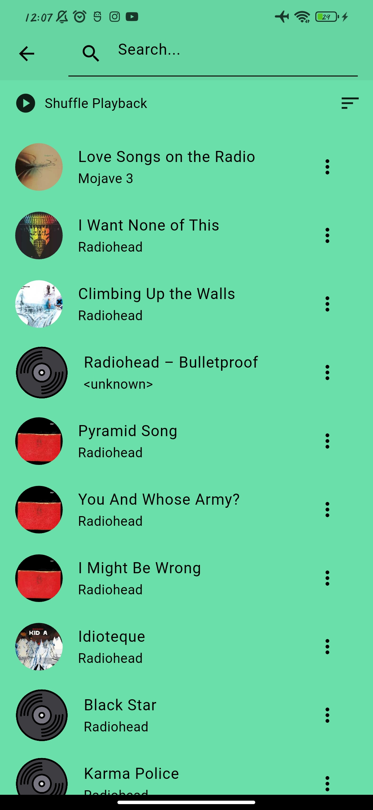
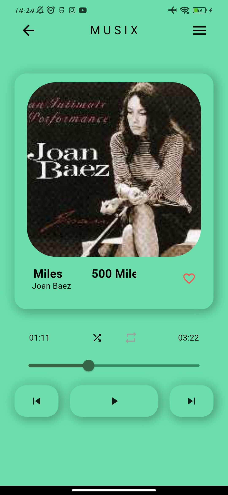
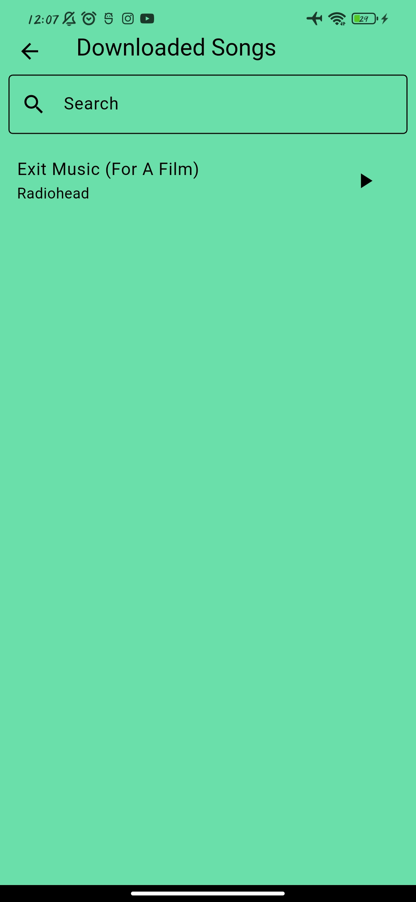
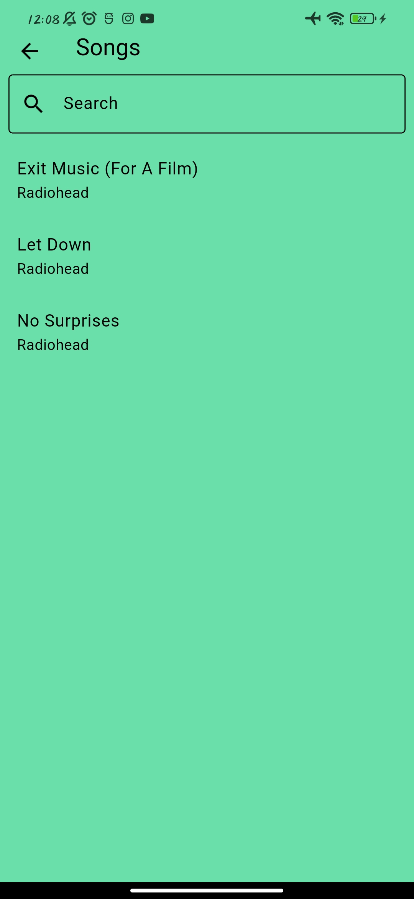
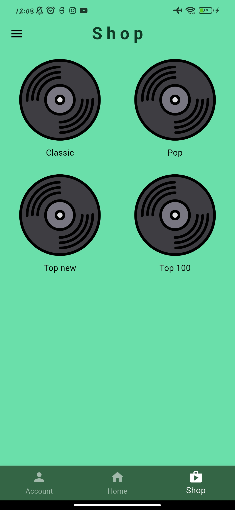

# AP Flutter Music Player Project (Spring 404)

This repository contains a Flutter-based frontend for a music player application, paired with a Java backend (using socket) and server-side components. 
The project supports local music playback, online music from a server, user authentication, and a server-backed music store with a dual-database approach.

---

## Table of Contents

- [Overview](#overview)
- [Project Structure](#project-structure)
- [Key Features](#key-features)
- [Architecture & Tech Stack](#architecture--tech-stack)
- [Database & Data Flow](#database--data-flow)
- [UI & UX Overview](#ui--ux-overview)

---

## Overview

- A mobile music player app with:
    - Local music playback (files stored on the device)
    - Online songs from a server (via socket-based communication)
    - User registration and login
    - Local and server-side song catalogs with categories
    - A shop section with paid/free songs, downloads, and reviews
    - User profile, wallet/credit, and subscription options
    - Playlist section that supports offline and online playlists
- Frontend: Flutter (Dart) with the FlutterFlow-like workflow
- Backend: Java with socket-based communication to the Flutter frontend
- Data persistence: dual-database setup (file-based and MySQL) as per project requirements

---

## Project Structure

- Frontend (Flutter)
    - Home
    - Music Shop
    - Song Details
    - Sign Up / Sign In (Login)
    - Music List/Category views
    - Player controls (play, pause, skip, shuffle, repeat)
    - Favorites/Watchlist
    - playlists(offline/online)
    - chat server
    - Authentication state management (Provider)
- Backend (Java)
    - User management (registration, login)
    - Song catalog (local and server-side)
    - Payments (simulated via a mock gateway)
    - Socket server for real-time data exchange
    - Database persistence (MySQL for song/metadata; text-based/file-based for certain user data; sqlite for offline playlist system)
- Data exchange
    - Base64-encoded payloads for binary data (e.g., audio files, images)
    - Socket-based communication between front-end and back-end
---

## Key Features

- Local music browsing and playback
- Server-sourced music with categories 
- creating playlists local and on-server
- chat screen with server and supporting forgotten data
- Search and sort capabilities (by name, rating, time added, plays, etc.)
- In-app playback controls with SeekBar progress
- Music Shop: login/signup, category browsing, song listing with purchase/download
- User account screen: profile picture, username, email, password changes, credits, and subscription management
- Payment screen: simulated card entry, transaction, and credit/subscription upgrade
- Real-time updates via Socket between frontend and backend
- Data persistence using:
    - MySQL for structured data (songs, users, purchases, etc.)
    - Text-based storage (for some non-binary data)
    - Sqlite for local playlists
---

## Architecture & Tech Stack

- Frontend: Flutter (Dart)
    - State management: Provider
    - Audio playback: Just Audio
    - File access: path_provider
    - Permissions: permission_handler
    - song models: on-audio-query
- Backend: Java 
    - Socket-based communication with the Flutter frontend
    - Database: MySQL (for songs, purchases, user data) and a text-based store (for certain metadata)
- Data formats:
    - Binary data (audio, images) in Base64 when transmitted
    - JSON payloads for structured data (where REST is used)
- Deployment considerations:
    - Multi-user concurrency via threading on the server
    - Data persistence across sessions using a database
    -  dual-database design is required

---

## Database & Data Flow

- User data
    - Stored in the text-based database (e.g., usernames, emails, passwords, subscriptions)
- Song data
    - Stored in MySQL (title, artist, cover image path, Base64-encoded audio, rating, etc.)
    - Audio delivery from server to client occurs after a purchase/download trigger
- Data exchange
    - Socket-based exchange for real-time synchronization
- Data format guidance
    - Audio and image binary data are Base64 encoded
    - Files stored locally on the device for offline playback
    - Paths or identifiers stored in the database to reference media

---

## UI & UX Overview

- Home Screen
    - Local and downloaded songs list
    - Sections to categorize songs by folders/albums
    - Song item tile with title, artist, cover, and play button
    - Search bar and sorting options
    - Bottom navigation for Home and Music Shop
    - “Favorites/Liked” list and a quick access to the current song
      
- Song Details
    - Album art, title, artist
    - Progress bar/Seekbar with time elapsed and remaining
    - Playback controls: play/pause, next, previous, shuffle, repeat
    - Option to add to favorites or create a “Lyrics” entry
      
      

- Music Shop
    - Sign Up / Sign In flows
    - Categories to filter songs
    - Song listings with cover art, title, artist, and rating
    - Purchase/download flow (simulated payment)
    - User account access and purchase history
        
        
      
- Account Screen
    - Profile image, username, email
    - Password change, logout, and account deletion
    - Wallet/credit balance and subscription management
    - Theme customization
    - Support chat link
- Payment Screen
    - Simulated card entry (dummy numbers)
    - Amount, payment button
    - Post-payment update to user balance/subscription
- Responsiveness
    - Consider across phones and tablets
    - UI components designed to adapt to screen sizes

---

