# AP Flutter Music Player Project (Spring 1404)

This repository contains a Flutter-based frontend for a music player application, paired with a Java backend (using socket) and server-side components.
The project supports local music playback, online music from a server, user authentication, and a server-backed music store with a dual-database approach.

---

## Table of Contents

- [Overview](#overview)
- [Project Structure](#project-structure)
- [Key Features](#key-features)
- [Architecture & Tech Stack](#architecture--tech-stack)
- [Database & Data Flow](#database--data-flow)
- [UI & UX Overview](#ui--ux-overview)

---

## Overview

- A mobile music player app with:
    - Local music playback (files stored on the device)
    - Online songs from a server (via socket-based communication)
    - User registration and login
    - Local and server-side song catalogs with categories
    - A shop section with paid/free songs, downloads, and reviews
    - User profile, wallet/credit, and subscription options
    - Playlist section that supports offline and online playlists
- Frontend: Flutter (Dart)
- Backend: Java with socket-based communication to the Flutter frontend
- Data persistence: dual-database setup (file-based and MySQL)

---

## Project Structure

- **Frontend (Flutter)**
    - Home
    - Music Shop
    - Song Details
    - Sign Up / Sign In
    - Music List/Category views
    - Player controls (play, pause, skip, shuffle, repeat)
    - Favorites/Watchlist
    - Playlists (offline/online)
    - Chat server
    - Authentication state management (Provider)

- **Backend (Java)**
    - User management (registration, login)
    - Song catalog (local and server-side)
    - Payments (mock gateway)
    - Socket server for real-time data exchange
    - Database persistence (MySQL + text-based store)

---

## Key Features

- Local music browsing and playback
- Server-sourced music with categories
- Creating playlists (local and online)
- Chat screen with server support
- Search and sort capabilities
- In-app playback controls with SeekBar
- Music Shop: login/signup, category browsing, purchase/download
- User account screen: profile, wallet/credits, subscription
- Payment simulation
- Real-time updates via Socket
- Dual-database persistence

---

## Architecture & Tech Stack

- **Frontend**: Flutter (Dart)
    - State management: Provider
    - Audio: Just Audio
    - File access: path_provider
    - Permissions: permission_handler
    - Models: on-audio-query
- **Backend**: Java
    - Socket server
    - MySQL + text-based storage
- **Data**
    - Base64 for audio/images
    - JSON for structured payloads
    - Local storage for offline playback

---

## Database & Data Flow

- **User data**: text-based database (username, email, password, subscription)
- **Song data**: MySQL (title, artist, cover path, Base64 audio, rating, etc.)
- **Exchange**: Socket-based, Base64 for binary, JSON for structured
- **Offline**: Files stored locally, playlists saved in SQLite

---

## UI & UX Overview
### Features

1. **User Management**
  - Edit username and password
  - Sign up / Login
  - Support for password recovery (forgot password)
  - Edit profile picture (avatar)

2. **Account & Payments**
  - Increase credit balance
  - Integrated payment system
  - Buy premium and VIP credit
  - User-friendly and editable fields

3. **Songs & Media**
  - List of all server songs
  - Download songs to local storage
  - View downloaded songs
  - Convert songs to Base64 from a specified folder

4. **Playlists**
  - Create playlists offline (SQLite)
  - Create playlists online (MySQL)
  - Manage personal playlists easily

5. **Comments & Ratings**
  - Send comments on songs
  - Rate songs and comments
  - Sorting system for comments and songs
  - Commenting and rating for server songs
  - Option to buy songs

6. **Categories & Shop**
  - Updated categories for songs in shop
  - Load categories dynamically

7. **Chat & Support**
  - Chat with admin (online support system)
  - Admin-server communication

8. **Testing & Development**
  - Added test database
  - Test Database Manager (TestDB Manager) for users

---

### Screenshots

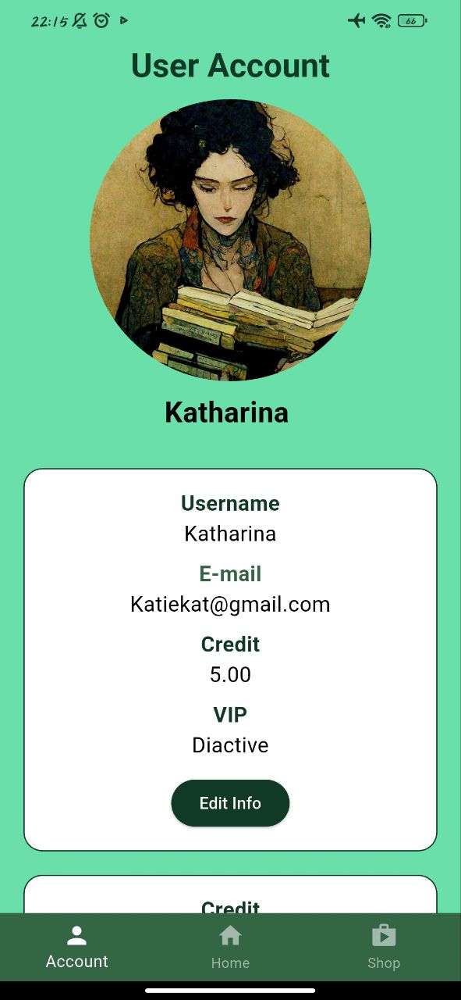
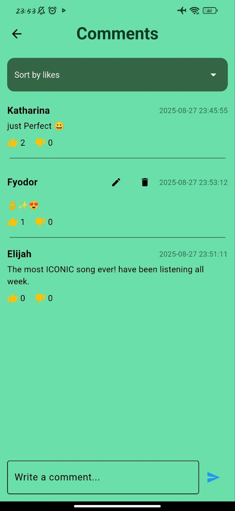
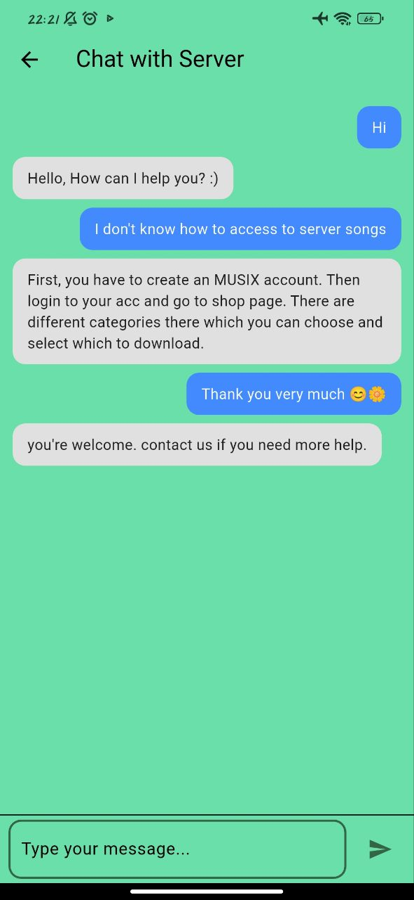
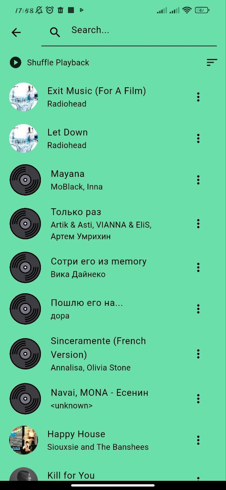
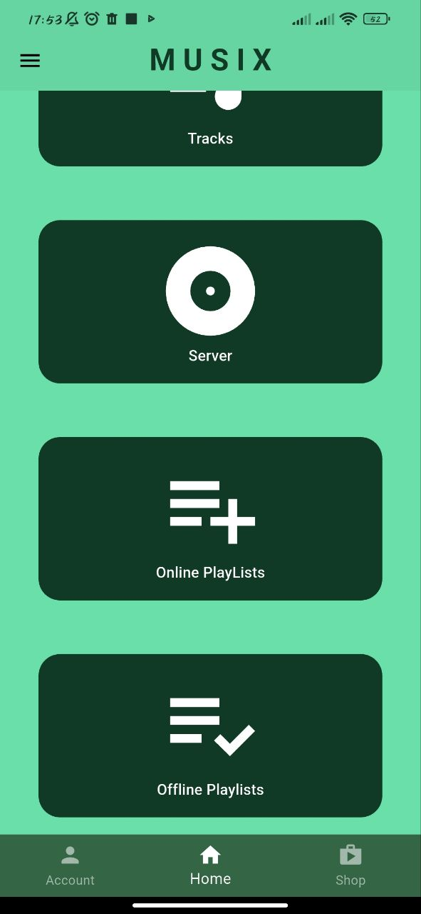
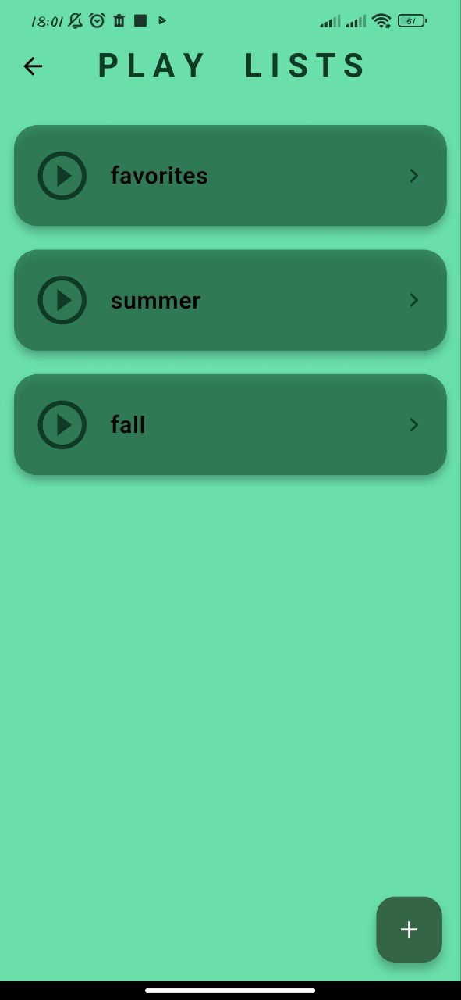
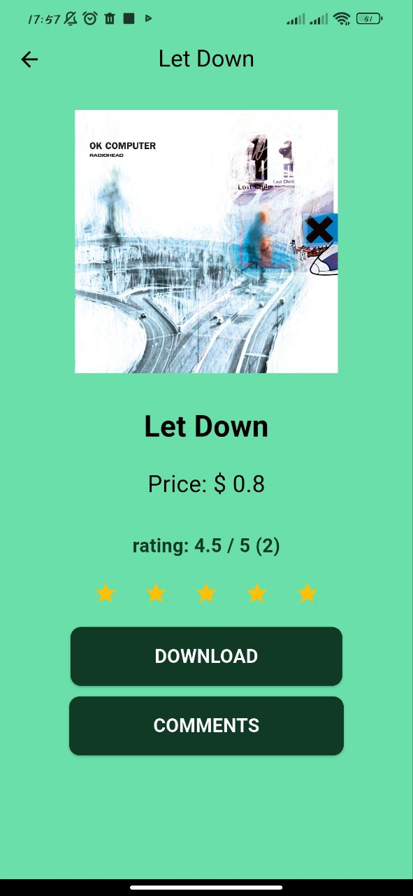
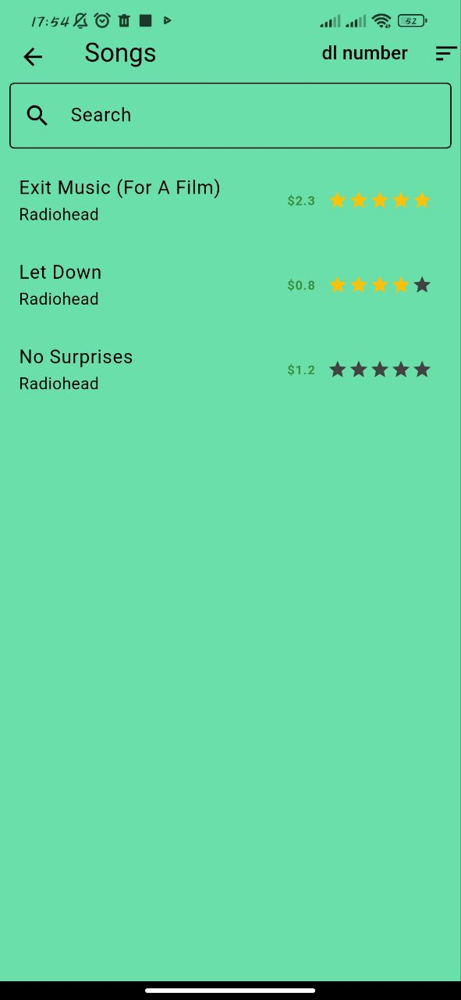
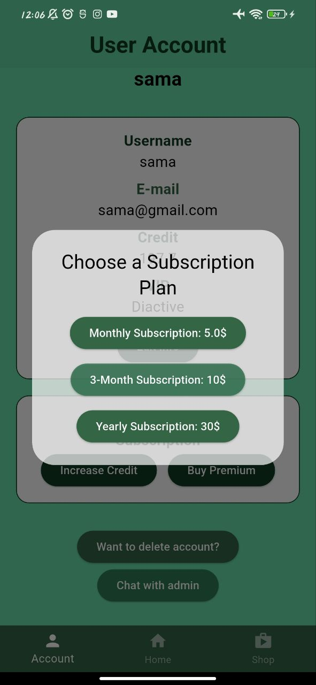
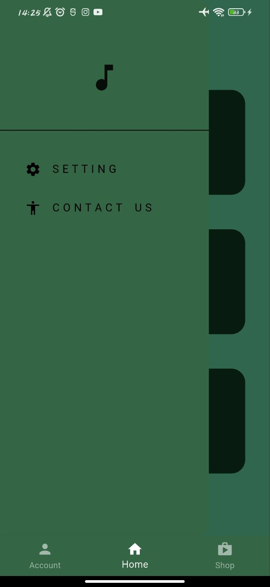
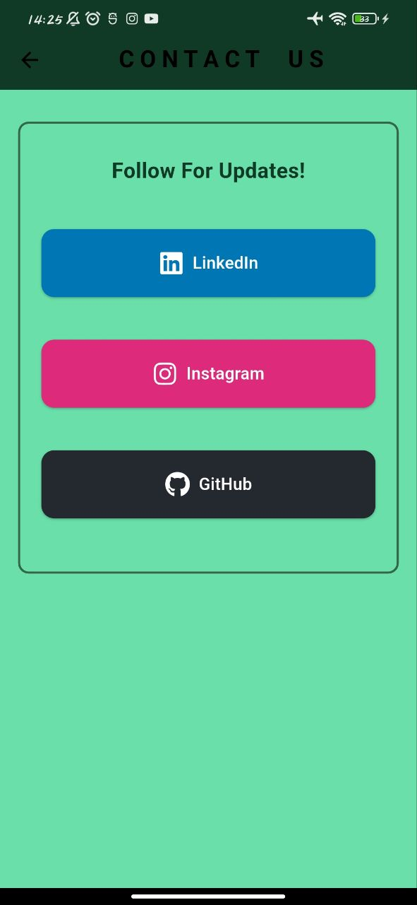
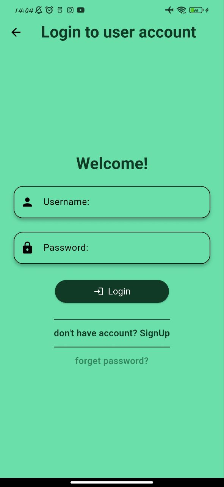
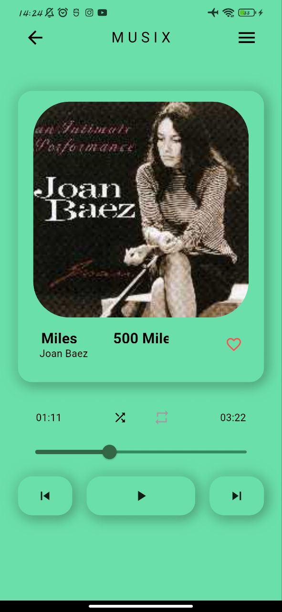
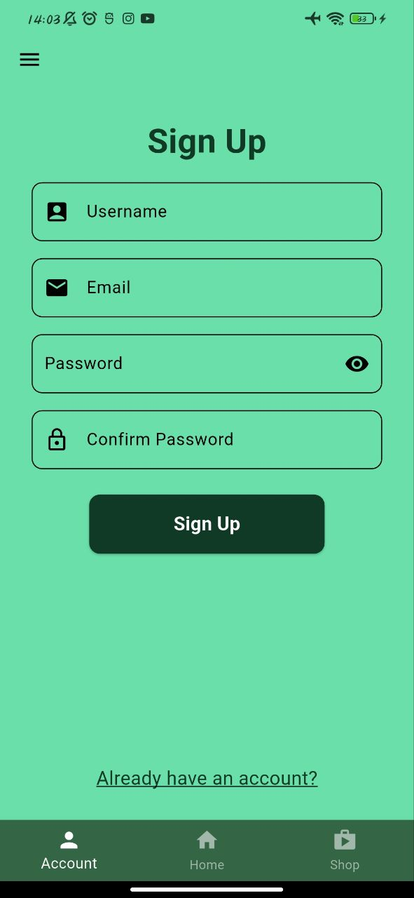
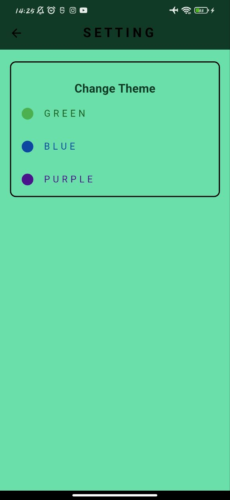
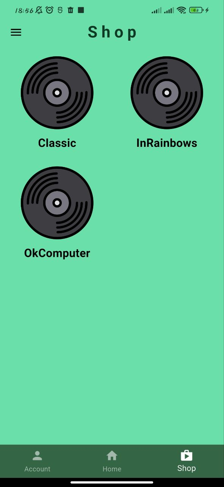

---

